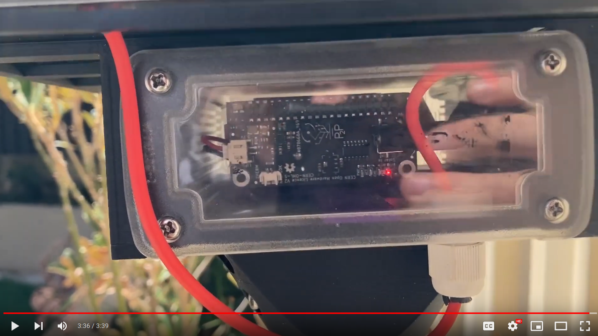

# PhotonPowerZero

The goal of the Photon Power Zero project is to build an ecosystem of electronics, code, BoM and, 3D printable parts that make it as easy as possible to go from a Raspberry Pi Zero proof of concept, sitting on someones desk, to an outdoor deployment. There is an inital Kickstarter planned and you can get one of the first boards by checking out the  [Kickstarter](https://www.kickstarter.com/projects/packets2photons/photon-power-zero)

You can find the user docs, showing you how to get started with the the Photon Power Zero, and the design decisions, around the board here:
* [USERDOCS](USERDOCS.md)
* [DESIGN_AND_DECISIONS](DESIGN_AND_DECISIONS.md)
* [LIPO_PURCHASING](LIPO_PURCHASING.md)

 
Photon Power Zero Board

The project is more than just the Photon Power Zero board. I want to create and share all of components to make it as easy as possible to deploy a Raspberry Pi Zero outdoors.

 
Youtube Video describing the Project and the goals
 

This is an open source project and so you can find the code for the Photon Power Zero and the Raspberry Pi, the kicad PCB files and the FDM 3D printing files below
* [Code](Code)
* [PCBs](PCBs)
* [FDM (3D Print Files)](FDM.md)

Production kit

Note that the Photon Power Zero does not come with a LiPo battery. You need to self source this and you should carefully read our [LIPO_PURCHASING](LIPO_PURCHASING.md) guide.

We have tested the solar panels from [Voltaic Systems](https://voltaicsystems.com/) We have tested the 6 Watt 6 Volt panels but we think that the 9-10 Watt panels will also work well.