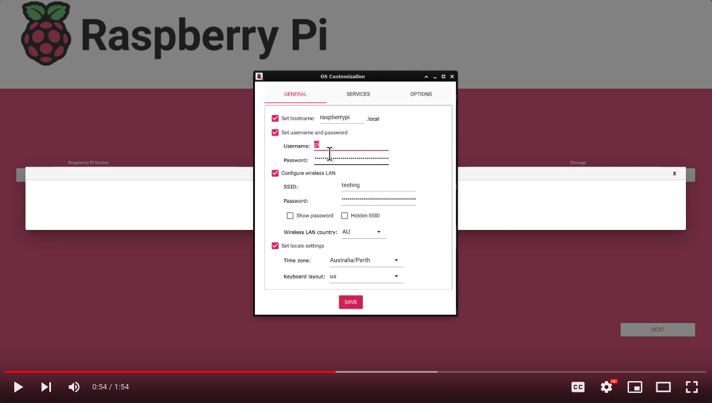
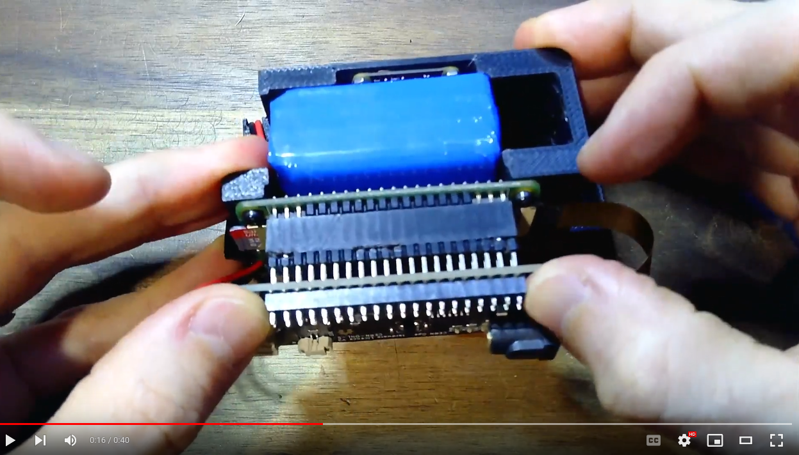

# User Documentation of the Photon Power Zero

## Before installing the Photon Power Zero on the Pi ###
 
If you have a Raspberry Pi Zero without soldered headers, you are going to need to solder headers on. You can do this yourself and there is a my  [Soldering a header on a Raspberry Pi Zero 2](https://youtu.be/pwCCnsn2Mug) video.
 
Start by writing a headles PiOS lite image onto your SD card. The following video steps you through this, as well as getting the settings right to be able to SSH into your Raspberry Pi without ever plugging a screen in.

[]( https://youtu.be/duxeGzRcJmE "Physically Installing the Photon Powre Zero on the Raspberry Pi Zero")

After flashing your Rasberry Pi using the instructions above, insert the SD card into your Raspberry Pi, then power the Raspberry Pi Zero through the micro USB connector as shown in the image below. Note that the first time the Pi Zero boots after flashing the SD card, it takes a while before you can see the device on your LAN. Go get yourself a coffee, be paitent and wait for it to appear; it often takes 5-10 minutes to appear during the first boot of a newly imaged SD card.

<p style="text-align:center; font-style:italic;">Start by Powering the Raspberry Pi through USB

In the image above, the Pi is being powered via a regular USB cable while we set it up for the Photon Power Zero. Make sure you NEVER power it through the Photon Power Zero and the USB port simultaneously. Now:

SSH into your Rasberry Pi with

`ssh [username]@[IP_address_of_Raspberry_Pi]`

Install required packages with:

`sudo apt update`

Then:

`sudo apt install python3 tmux libcamera-apps python3-pip`

Now, we are going to allow a graceful shutdown if GPIO Pin 20 is pulled low; the Raspberry Pi will shut down. This is how a shutdown is initiated from the Photon Power Zero to the Raspberry Pi.

`sudo nano /boot/config.txt`

If you are using the latest 64 bit image you may need to:

`sudo nano /boot/firmware/config.txt`

Then, we insert the following line at the end of the file:

`dtoverlay=gpio-shutdown,gpio_pin=21,active_low=1,gpio_pull=up`

Download the Raspberry Pi code onto your Raspberry Pi. The easiest way to do this is from the command line of your Raspberry Pi you can:

`wget https://raw.githubusercontent.com/DavidMurrayP2P/PhotonPowerZero/main/Code/PPZ_RPi_code.py`

You can then provide the file with execute permissions with

`chmod 777 PPZ_RPi_code.py`

You can then move the file to /usr/bin

`sudo mv PPZ_RPi_code.py /usr/bin/PPZ_RPi_code.py`

Now you can edit:

`sudo nano /etc/rc.local`

Add the following before exit 0

```
sleep 10
su -l pi -c "tmux new -s monitor -d"
su -l pi -c "tmux send-keys -t monitor '/usr/bin/PPZ_RPi_code.py' C-m"
```

Change the username pi to whatever your userlevel user is, save and exit. As an example, I called my raspberry pi user david and therefore my /etc/rc.local file looked similar to below: 

<p style="text-align:center; font-style:italic;">The /etc/rc.local file

Now test by running:

`sudo /etc/rc.local`

The command line will appear to hang for 10 seconds before returning you to the terminal. When it does, run:

`tmux attach`

You should have a message saying:

Internet connection working

Note that if you have never used tmux before, you can exit this terminal by hitting 

`ctrl b then d`

Turn off your Pi by removing the USB Power. Now remove the USB cable from your desk; I want to prevent you from powering your Pi through this again. You must NEVER power your Raspberry Pi through that USB port while the Photon Power Zero board is attached.

## Physically Install the Photon Power Zero on the Rasberry Pi Zero

The image below will take you to a YouTube video showing you how to carefully install the Photon Power Zero.

[]( https://youtu.be/dVccMCOYDCo "Physically Installing the Photon Powre Zero on the Raspberry Pi Zero")

Note: Never power the Raspberry Pi via the LiPo Battery and the USB port on the Raspberry Pi. **You cannot charge the battery from the 5v USB port on the Raspberry Pi.**

Please also ensure that your battery has the correct polarity.
  

<p style="text-align:center; font-style:italic;">Make sure the polarity on the JST connector is correct.</p>

Please also ensure that you have read our [LIPO_PURCHASING](LIPO_PURCHASING.md) guide.

Now you can plug in your battery first, then your cable that will charge the battery over USB. If your battery is well charged, your Pi should start booting. Note that if your battery is not well charged and the voltage of your LiPo battery is below 3.75V, then your Raspberry Pi will not turn on. If you are charging from USB, then likely you will need to be very paitent as USB will limit the charge rate to 0.1 Amps.

SSH in and then, as a user, run:

`tmux attach`

You should see the output of the Python program that you have run. You should be seeing your Photon Power Zero reporting a sensible voltage to your Raspberry Pi.


## Troubleshooting ##

If you cannot set up the Wifi and enable SSH from the image creation stage, you can choose to plug in a HDMI connector, connect to your Wifi, and install the open SSH server via the command line with:

```
sudo apt update
sudo apt install openssh-server
```

Note if you have what looks like a runtime error on your Raspberry Pi and are running the latest Bookworm release. Try the following

```
sudo apt remove python3-rpi.gpio
sudo apt install python3-rpi-lgpio
```
